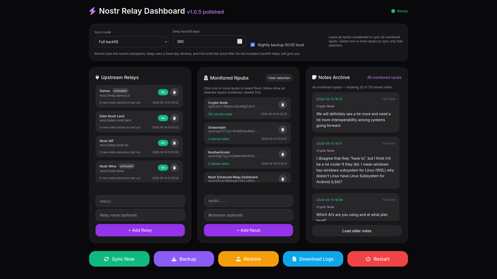

# Nostr Relay Dashboard v1.0.5 polished bundle

This bundle is a self-contained Rust + Axum + SQLite build of NRD with the requested v1.0.5 polish changes:

- leave all npubs unselected and Sync Now will sync all monitored npubs
- select one or more npubs and Sync Now will sync only those selected npubs
- notes archive shows notes from all selected npubs combined in reverse chronological order
- if no npubs are selected, the notes archive shows all monitored npubs combined
- backup, restore, logs, nightly backup setting, and relay/npub management are included

## Files included

- `Cargo.toml`
- `src/main.rs`
- `public/index.html`
- `deploy/caddy/` example Caddyfiles for local-only, Tailnet-only, and public HTTPS
- `scripts/` install scripts for each of the three deployment modes

## Quick local build

```bash
source "$HOME/.cargo/env"
cargo run
```

Default app bind:
- `HOST=127.0.0.1`
- `PORT=8080`

## Notes

- Caddy reverse-proxies to NRD on `127.0.0.1:8080` in all example configs.
- If you set `admin off` in a Caddyfile, use `systemctl restart caddy` instead of `reload`.
- For public deployment, set `NRD_ADMIN_TOKEN`.

## Credits

Huge thanks to Grok for idea generation and feature brainstorming, and to ChatGPT for the release packaging and implementation pass, and the NOSTR community!

## Screenshot


